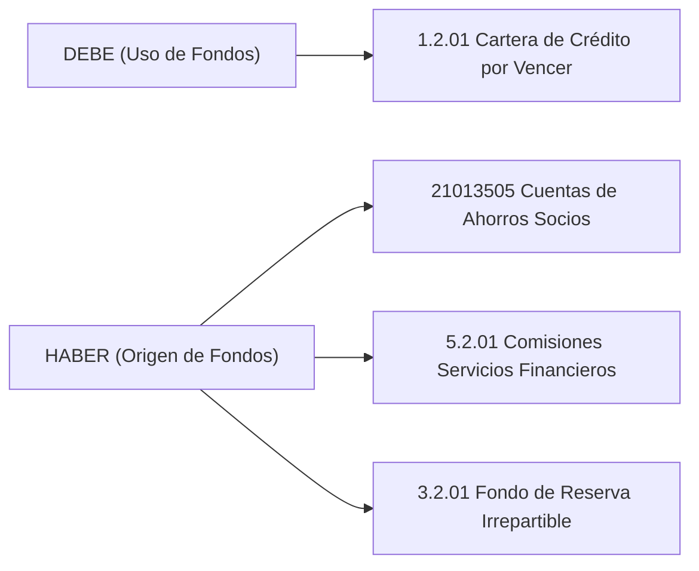

# Documentación de Cumplimiento Regulatorio (SEPS Ecuador)

Este documento detalla la lógica técnica de impresión de documentos y la parametrización contable del plan de cuentas de la **Superintendencia de Economía Popular y Solidaria (SEPS)** de Ecuador para el módulo de créditos de la cooperativa.

---

## 1. Mapeo de Variables para la Generación del Pagaré a la Orden

El pagaré es el título valor fundamental que respalda la obligación del socio. Su estructura legal en Ecuador exige el mapeo de variables dinámicas provenientes de las tablas `dbo.RegistroSocios` y `dbo.SolicitudesCredito`:

| Campo Legal en Pagaré | Variable Técnica | Origen en BD / Cálculo | Tipo de Dato |
|---|---|---|---|
| **Nombre del Deudor** | `NombreCompleto` | `dbo.RegistroSocios.PrimerNombre + ' ' + dbo.RegistroSocios.Apellidos` | `NVARCHAR` |
| **Cédula de Identidad** | `Identificacion` | `dbo.RegistroSocios.Identificacion` | `NVARCHAR` |
| **Monto del Crédito** | `Monto` | `dbo.SolicitudesCredito.Monto` | `DECIMAL(15,2)` |
| **Monto en Letras** | `MontoLetras` | Función de conversión (Ej: "CINCO MIL CON 00/100 DÓLARES") | `NVARCHAR` |
| **Tasa de Interés (TEA)**| `Tasa` | `dbo.SolicitudesCredito.Tasa` | `DECIMAL(5,2)` |
| **Plazo (Meses)** | `Plazo` | `dbo.SolicitudesCredito.Plazo` | `INT` |
| **Fecha de Emisión** | `FechaDesembolso` | `dbo.Creditos.FechaDesembolso` | `DATETIME2` |
| **Fecha de Vencimiento** | `FechaVencimiento`| `dbo.SolicitudesCredito.FechaVencimiento` | `NVARCHAR` |
| **Tabla Amortización** | `PlanPagos` | `dbo.SolicitudesCredito.PlanPagos` (JSON de cuotas adjunto) | `NVARCHAR(MAX)` |

### Conversión del Monto a Letras (Algoritmo Técnico)
En la generación del documento, es obligatorio que el monto figure en letras para evitar adulteraciones del título ejecutivo (Art. 486 del Código de Comercio de Ecuador). El desarrollador debe invocar una función helper contable que tome el `Monto` decimal y retorne la cadena de texto normalizada.

---

## 2. Plan de Cuentas Contable Homologado con la SEPS

El desembolso de créditos genera un asiento contable compuesto de 4 partidas para registrar la colocación de la cartera, la entrega de fondos netos al socio y las retenciones legales/comerciales aplicadas.

Según la normativa de la SEPS, las cuentas se mapean y comportan de la siguiente manera:

### Asiento Contable Tipo (Desembolso de $5,000.00 USD)

Para una colocación de **$5,000.00 USD** con **1.0% de comisión de desembolso** ($50.00 USD) y **0.5% de aporte al fondo irrepartible** ($25.00 USD), el sistema ejecuta la siguiente afectación en `dbo.RegistroContable`:

| Cuenta Contable | Nombre de Cuenta (SEPS) | Debe | Haber | Tipo de Movimiento |
|---|---|---|---|---|
| **1.2.01** | Cartera de Crédito de Consumo Ordinario por Vencer | $5,000.00 | $0.00 | **Débito**: Registro de la colocación del activo financiero (cartera por cobrar). |
| **21013505** | Depósitos de Ahorro a la Vista (Socio) | $0.00 | $4,925.00 | **Crédito**: Acreditación en cuenta de ahorros del socio (monto neto desembolsado). |
| **5.2.01** | Comisiones por Servicios de Crédito | $0.00 | $50.00 | **Crédito**: Registro del ingreso por comisión de servicio de desembolso. |
| **3.2.01** | Fondo Social de Reserva Irrepartible | $0.00 | $25.00 | **Crédito**: Retención de patrimonio / reserva según estatuto de la Cooperativa. |
| **TOTAL** | | **$5,000.00** | **$5,000.00** | **Partida Doble Balanceada (OK)** |

### Reglas de Integridad Contable
1. **Partida Doble**: Todo asiento contable de desembolso debe cumplir con la ecuación fundamental: \(\sum \text{Debe} = \sum \text{Haber}\).
2. **Registro de Solicitud**: El asiento se realiza en el instante del cambio de estado de `APROBADO` a `VIGENTE` (desembolso efectivo) mediante una transacción SQL atómica, garantizando que el dinero nunca quede flotando en el balance.
